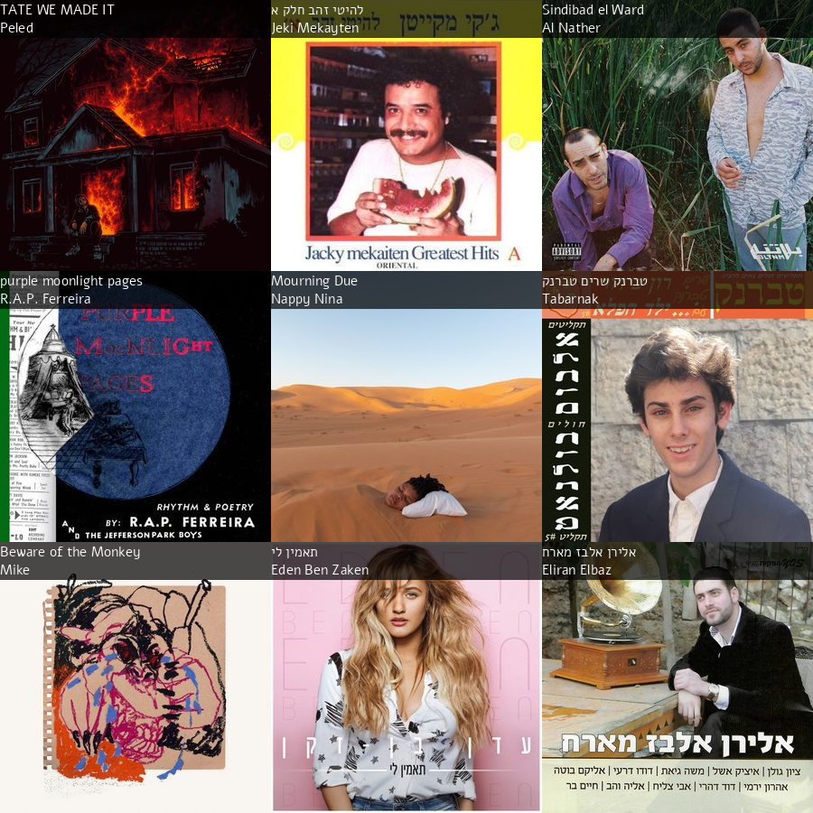

# Last Sikum — Python Last.fm collage generator

Yet another collage generator, except this time it's not a web app but a good
old importable Python script:) A collage is a picture consisting of the 9
albums you've been obsessed with over the last 30 days, and it looks like this:



## Installation
You might want to use [pipx](https://pypa.github.io/pipx) here:
```shell
pipx install git+https://github.com/it-is-wednesday/last-sikum.git
```

## Usage
First, shove your [Last.fm API keys](https://www.last.fm/api/account/create) into a `.env` file that looks like this:
``` shell
LASTFM_API_KEY=073ab897929a93851e4fbci1f9c22fc7
LASTFM_API_SECRET=f75d26cd60a2k2u4232aa4284ljk2192
```

Then, to generate the collage:
``` shell
last-sikum collage.png /usr/share/fonts/TTF/DejaVuSans.ttf
```

## Development
Install dependencies in a venv:
```shell
pip install .
```
